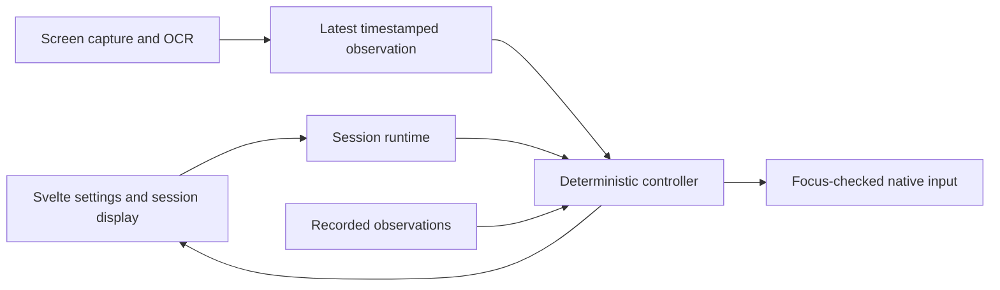

# Automation architecture

The active app stays on Tauri 2. The portable `crates/fishing-core` crate contains the deterministic controller, detectors, configuration, storage and replay. Desktop modules re-export the existing public paths for compatibility. The previous monolith is preserved under `legacy/`.

## Responsibilities

| Module | Responsibility |
| --- | --- |
| `engine.rs` | State transitions, deadlines, confirmations, recovery and action requests |
| `runtime.rs` | Session lifecycle, separate observation/control threads, cancellation and statistics |
| `capture.rs` | Main-display capture, Retina mapping and reference-size normalization |
| `detection.rs` | Bite, catch, selection-border detection and Energy parsing |
| `ocr.rs` | Tesseract execution with cancellation and a 2.5-second limit |
| `input.rs` | Native input and foreground Roblox checks on macOS/Windows |
| `diagnostics.rs` | Read-only PNG/live-capture inspection and crop previews |
| `config.rs`, `storage.rs` | Validated settings, profiles and atomic storage |
| Core `replay.rs`, `bin/fishing-core-cli.rs` | Offline observation scenarios and expected-action verification |
| `main.rs` | Tauri commands and application lifecycle |
| `readiness.rs` | Non-prompting permission, profile, OCR, focus and emergency-stop checks |
| `recording.rs` | Bounded optional session evidence and exact-timestamp offline replay |
| `crates/fishing-core/src/protocol.rs` | Versioned JSON interface used by the Swift prototype |

The frontend separates session display, calibration inspection, settings, and typed IPC. Browser preview cannot run automation or pretend that native operations succeeded.

## Control contracts

The normal flow is startup → rod reset/selection → ready → casting → waiting for bite → reeling → catch confirmation → optional Energy check → cooldown. Feeding explicitly selects food, verifies selection, clicks once, verifies increased capacity twice, and restores the rod before continuing.

- Only the control thread owns native input. It emits at most one action per step; late ticks do not cause bursts of missed clicks.
- Observe-only follows exactly the same controller, but its input factory is never invoked. Its catches, feeding and elapsed time never modify lifetime statistics.
- The global Control + Shift + F12 shortcut cancels sessions even when the game has focus. Registration failure blocks automation. A single-instance plugin prevents independent desktop controllers.
- Input checks Roblox foreground identity immediately before execution. Focus loss pauses; resuming requires a new session.
- Observations have increasing sequence numbers and capture timestamps. Old, future-dated or repeated frames cannot authorize fresh confirmations. A bite flag must have actually been measured before it can authorize a cast.
- Each verification phase has a hard deadline. Fishing timeouts attempt a bounded rod reset; unresolved selection/feeding failures pause instead of repeatedly clicking.
- A catch needs two distinct positive frames at least 100 ms apart. An existing notification must disappear before it can count as another catch.
- Feeding compares absolute Energy capacity with an explicit threshold. The usable/capacity ratio is not a measure of remaining food reserve. Invalid or unsupported readings fail closed.
- Settings are validated and frozen during a session. Inspection cannot overlap automation or configuration changes.
- The observation worker keeps only the latest frame result, avoiding a growing backlog. OCR runs only when needed; reeling continues on a separate controller schedule.
- Capture/analysis latency and frame age are shown in the UI. State is published on transitions or every 250 ms; the controller still ticks every 10 ms. A slow observation does not build a queue or add another fixed delay after processing.
- Energy OCR has its own error field. Optional monitoring can continue without feeding on OCR failure; feeding and general capture errors remain blocking. Finder-compatible discovery checks normal install locations and verifies English data.
- Opt-in recordings retain the first 30,000 raw controller ticks with original capture sequences and timestamps. Session timelines retain 200 significant events. JSON replay accepts at most 32 MiB and 30,000 frames, validates configuration/version/monotonic time, and compares actual phase/actions/counters with expected values. A settings override reruns observations without expected-value comparison; it cannot recompute image detectors.
- Stop requests cancellation. Orderly shutdown finalizes statistics; periodic 30-second checkpoints limit potential loss from an unexpected exit. OCR can be killed; synchronous OS capture cannot.

## Verification and remaining work

Controller tests cover normal cycles, lingering notifications, stale observations, focus loss, cancellation in every phase, deadlines, recovery limits, rod loss and feeding confirmation. JSON replay scenarios run the same production controller without OS input. Original screenshot tests cover bite/catch/selection/Energy, relocated bite markers, simulated Retina crops, and the PNG inspector.

These tests do not prove that the game accepts the reset/cast/click sequence or that the provisional timing works under load. Full-frame capture makes each observation coherent, but its real latency still needs measurement. Windows requires native compilation and runtime validation. Live macOS capture/input, low-capacity Energy, consumed food, altered camera views and notification animations need recorded sessions or supervised testing.

Start with the read-only calibration inspector, then a short supervised fishing session with automatic feeding disabled. Tune from recorded evidence before enabling unattended operation. Keep the existing calibrated detector assets; further rebuilding should be driven by failures observed in these checks.

## Desktop upgrade (2026-09-08)

The desktop shell now uses Tauri 2.11, with Svelte 5 and Vite 8. The main local window may subscribe to controller events; no broad filesystem, shell or remote-origin permissions are enabled. A content security policy restricts scripts and network connections. Custom Rust commands retain configuration validation and session ownership checks.

Dashboard, Calibration and Settings have separate views. Calibration results and unsaved settings survive navigation between them. Appearance is stored locally. The controller and saved settings format remain compatible with the preceding restructure.

Use Node 20.19+ or 22.12+ (Node 24 is verified). Commit/use both lockfiles to keep the tested native and frontend dependency sets together. The local npm audit reported zero known advisories after this upgrade; that is not a complete security audit.

The calibration overlay consists of pure geometry in `overlay.rs`, desktop window lifecycle in `overlay_window.rs`, and a separate read-only Svelte view. It holds the existing inspection reservation until its native window is destroyed, blocking automation and capture while coloured outlines are present. macOS transparency requires Tauri's `macos-private-api` feature; the current local desktop build is not an App Store distribution target.
